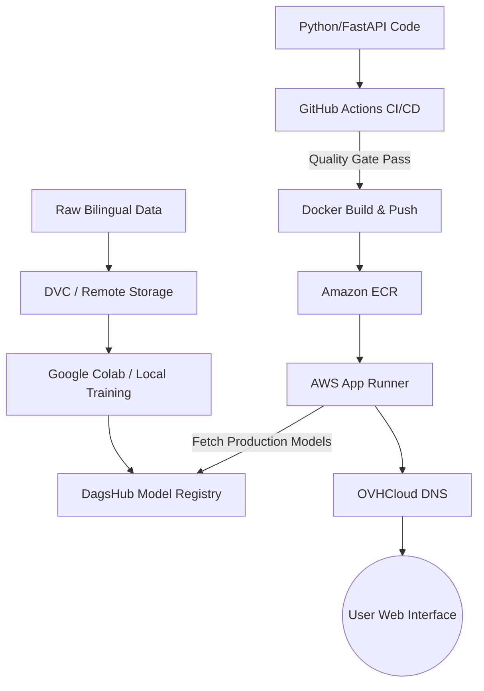

# Deepo: Production-Grade Neural Machine Translation System

Deepo is an advanced Machine Translation platform developed as a combined final project for Master 2 courses in Natural Language Processing (NLP) and Machine Learning Operations (MLOps). The system provides high-fidelity translation between English and five expert languages (French, Spanish, Mandarin, Portuguese, and English) using a pivot language architecture.

The production environment is publicly accessible at: [https://www.kevin-kurtz.fr](https://www.kevin-kurtz.fr)

## 🏗 Architecture Diagram

The following diagram illustrates the integration between data versioning, model tracking, automated CI/CD pipelines, and cloud deployment.



## 🧠 NLP System Overview

The core translation engine is built on a Sequence-to-Sequence (Seq2Seq) architecture using Long Short-Term Memory (LSTM) networks.

### Model Characteristics
* **Attention Mechanism**: Implementation of Bahdanau Attention to handle long-range dependencies in complex sentences.
* **Bi-directional Encoding**: A bidirectional LSTM encoder captures context from both directions of the source text.
* **Pivot Logic**: Translation between non-English pairs (e.g., French to Portuguese) is handled via an English pivot, utilizing two expert models in a single request pipeline.
* **Preprocessing**: Custom tokenization for CJK (Chinese, Japanese, Korean) characters and automated regex filters to prevent word-looping during greedy decoding.

## 🚀 MLOps Infrastructure

This project implements a complete MLOps lifecycle to ensure reproducibility and stability.

### Data Versioning (DVC)
Bilingual datasets are tracked using DVC. This ensures that every training run is tied to a specific data version, with the raw large files stored on remote storage while metadata is managed within the Git repository.

### CI/CD Pipelines
The repository utilizes three distinct GitHub Actions workflows to enforce the 12-Factor App methodology:
1. **Pull Request to Dev**: Executes unit and integration tests and validates the Docker build.
2. **Push to Staging**: Performs the full test suite and automatically deploys the latest image to AWS App Runner (Staging environment).
3. **Promote to Main**: Triggers model quality gates. Successful validation promotes the model stage in the registry and prepares the production release.

### Model Registry and Promotion
We use MLflow hosted on DagsHub as our single source of truth.
* **Candidate Registration**: New models are logged with parameters, metrics, and Git/DVC hashes.
* **Quality Gates**: The `ml/gates.py` script automatically validates performance metrics (e.g., latency < 500ms, accuracy thresholds).
* **Automated Promotion**: Models passing the gates are transitioned to the `Production` stage. The API dynamically pulls only `Production` models to serve inference.

## 📦 Reproducibility Instructions

### Local Environment Setup
To run the system locally using Docker Compose:
```bash
docker-compose up --build
```
The application will be available at `http://localhost:8080`.

### Running Tests
The project includes a comprehensive suite of 7 tests, including Unit, Integration, and End-to-End (E2E) scenarios.
```bash
# Ensure dependencies are installed
pip install -r ml/requirements.txt
# Execute tests
pytest -v
```

### API Documentation
The backend infrastructure provides an interactive Swagger UI for direct endpoint testing.
* **Development**: `http://localhost:8000/docs`
* **Production**: `https://www.kevin-kurtz.fr/docs`

## 🛠 Technology Stack
* **Backend**: Python 3.11, FastAPI
* **ML Libraries**: PyTorch, MLflow
* **Infrastructure**: Docker, AWS App Runner, Amazon ECR
* **Data/Registry**: DVC, DagsHub
* **Domain/DNS**: OVHCloud